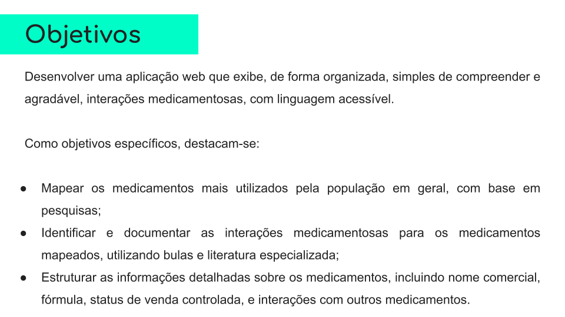
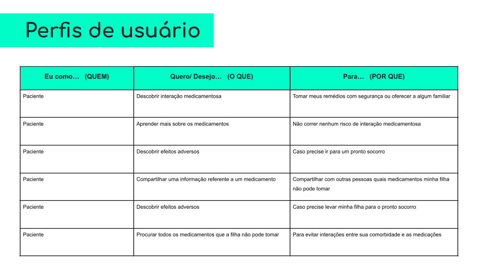
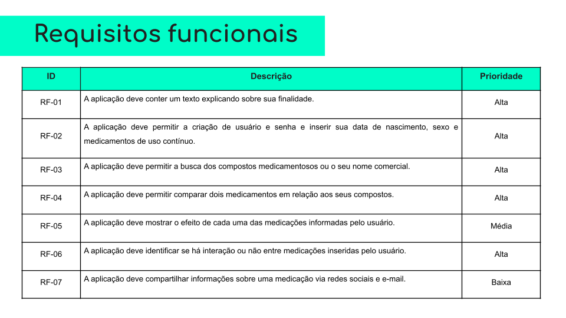
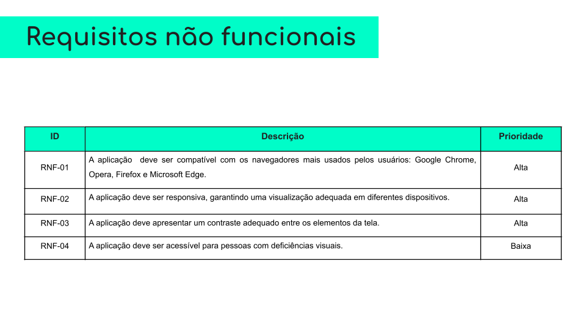

# Apresentação do Projeto

## Conjunto de Slides

Foi desenvolvida uma apresentação sobre o projeto, que pode ser conferida abaixo.

Voce pode encontrar o PDF da apresentação [aqui](slides.pdf).

Figura 1 - Slide inicial.

Figura 2 - Segundo slide.

Figura 3 - Terceiro slide.

Figura 4 - Quarto slide.

Figura 5 - Quinto slide.

Figura 6 - Quinto slide.

Figura 7 - Sexto slide.

Figura 8 - Oitavo slide.

Figura 9 - Nono slide.

Figura 10 - Décimo slide.

Figura 11 - Décimo primeiro slide.

Figura 12 - Décimo segundo slide.

Figura 13 - Décimo terceito slide.

Figura 14 - Décimo quarto slide.

<!--
## Vídeo de apresentação

A equipe também deverá gravar um vídeo de, no máximo, três minutos, com a apresentação da solução. Vocês deverão abrir a aplicação hospedada e apresentar o seu funcionamento.  Poderão ser utilizados quaisquer recursos na montagem do vídeo, mas não se esqueçam de mostrar as funcionalidades da aplicação. Seguem as especificações técnicas que devem ser obedecidas na geração do vídeo:

> - tamanho do arquivo limitado a 90Mb
> - taxa de FPS limitada a 30 quadros por segundo
> - resolução HD (720p) ou Full HD (1080p)
> - formato mp4.

[Adicione vídeo de apresentação.]

-->

## Hospedagem

[Adicione o endereço eletrônico público onde o site encontra-se hospedado.]
