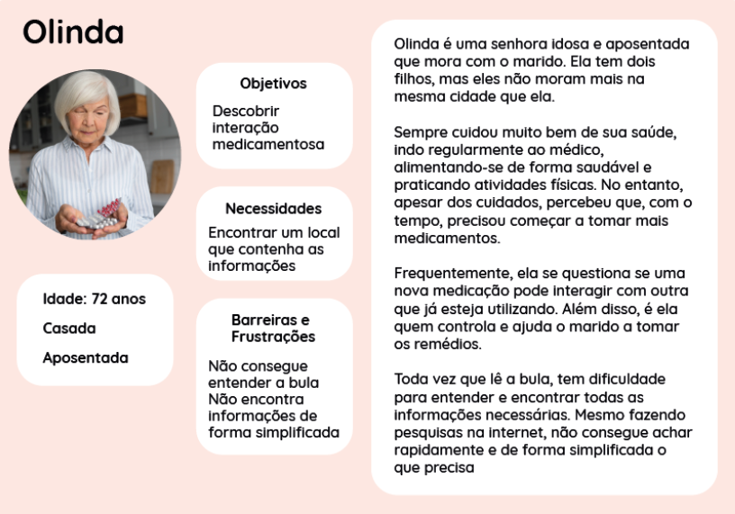
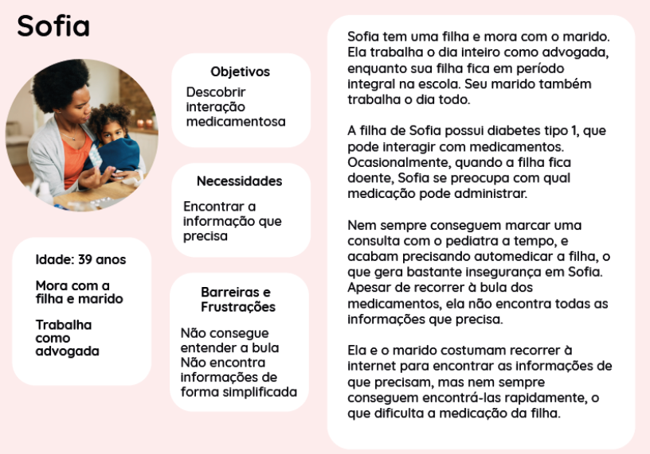

# Especificação do projeto

## Perfis de usuários

Foram definidos dois perfis de usuário, um perfil de paciente e um de administrador. Nas figuras 1 e 2, temos duas **personas** criadas para o perfil de paciente (perfil 1).

Figura 1: persona 1 para perfil de usuário de paciente (**perfil 1**).

Figura 2: persona 2 para perfil de usuário de paciente (**perfil 1**).

Tabela 1: perfil de usuário com descrição e necessidades para o perfil de paciente (perfil 1).
<table>
<tbody>
<tr align=center>
<th colspan="2">Paciente</th>
</tr>
<tr>
<td width="150px"><b>Descrição</b></td>
<td width="600px">Paciente que utiliza ou pesquisa medicamentos.</td>
</tr>
<tr>
<td><b>Necessidades</b></td>
<td>
<li>1. Acesso rápido e fácil às informações referentes ao medicamentos;</li>
<li>2. Conteúdo com linguagem para pessoas leigas;</li>
<li>3. Compartilhamento de informações;</li>
<li>4. Interface intuitiva;</li>
<li>5. Acessibilidade; </li>
</td>
</tr>
</tbody>
</table>

Tabela 2: perfil de usuário com descrição e necessidades para o perfil administrador (perfil 2).
<table>
<tbody>
<tr align=center>
<th colspan="2">Administrador</th>
</tr>
<tr>
<td width="150px"><b>Descrição</b></td>
<td width="600px">Usuário administrador que pode realizar alterações no conteúdo e curadoria das informações.</td>
</tr>
<tr>
<td><b>Necessidades</b></td>
<td>
<li>1. Segurança para permitir apenas a um usuário administrador a capacidade de editar dados;</li>
<li>2. Possibilidade de inserir e/ou editar informações sobre medicamentos na plataforma;</li>
</td>
</tr>
</tbody>
</table>

## Histórias de usuários

Com base na análise das personas forma identificadas as seguintes histórias de usuários:

Tabela 3: histórias de usuários para os perfis criados.
|EU COMO... `QUEM`   |QUERO/PRECISO... `O QUE` |PARA... `PORQUE`|
|:------------------:|:-----------------------:|:---------------|
|Paciente|Descobrir interação medicamentosa|Tomar meus remédios com segurança ou oferecer a algum familiar;|
|Paciente|Aprender mais sobre os medicamentos|Não correr nenhum risco de interação medicamentosa;|
|Paciente|Descobrir efeitos adversos|Caso precise ir para um pronto socorro;|
|Paciente|Compartilhar uma informação referente a um medicamento|Advertir outras pessoas quais medicamentos não posso tomar ou não devem ser tomados em combinação;|
|Paciente|Procurar todos os medicamentos que a filha não pode tomar|Para evitar interações entre sua comorbidade e as medicações;|
|Paciente|Sugerir a adição de uma nova medicação|Adicionar novos dados na plataforma;|
|Paciente|Quero salvar meus dados cadastrais|Facilitar as próximas consultas na plataforma;|
|Administrador|Realizar alterações no conteúdo da plataforma|Fazer curadoria e inserir novos dados na plataforma;|

## Requisitos do projeto

Abaixo, os requisitos funcionais e não funcionais da aplicação.

### Requisitos funcionais

Tabela 4: requisitos funcionais do projeto.
| ID    | Descrição                | Prioridade |
|:-----:|:------------------------:|:----------:|
| RF-01 |A aplicação deve permitir a busca dos compostos medicamentosos ou o seu nome comercial.|**Alta**|
| RF-02 |A aplicação deve permitir comparar dois medicamentos em relação aos seus compostos.|**Alta**|
| RF-03 |A aplicação deve exibir a aplicação de cada uma das medicações informadas pelo usuário.|**Média**|
| RF-04 |A aplicação deve identificar se há interação ou não entre medicações inseridas pelo usuário.|**Alta**|
| RF-05 |A aplicação deve compartilhar informações sobre uma medicação via redes sociais e e-mail.|**Baixa**|
| RF-06 |A aplicação  deve permitir a alteração e adição de dados para o perfil administrador.|**Alta**|
| RF-07 |A aplicação deve permitir o login de administrador e login de usuário.|**Alta**|
| RF-08 |A aplicação deve permitir a criação de usuário inserindo data de nascimento e gênero.|**Alta**|
| RF-09 |A aplicação deve permitir que o perfil administrador insira os efeitos adversos e esperados junto às medicações.|**Alta**|

### Requisitos não funcionais

Tabela 5: requisitos não funcionais do projeto.
| ID     | Descrição                | Prioridade |
|:------:|:------------------------:|:----------:|
| RNF-01 |A aplicação deve ser compatível com os navegadores mais usados pelos usuários: Google Chrome, Opera, Firefox e Microsoft Edge.|**Alta**| 
| RNF-02 |A aplicação deve ser responsiva, garantindo uma visualização adequada em diferentes dispositivos.|**Alta**| 
| RNF-03 |A aplicação deve apresentar um contraste adequado entre os elementos da tela.|**Alta**|
| RNF-04 |A aplicação deve ser acessível para pessoas com deficiências visuais.|**Baixa**|

