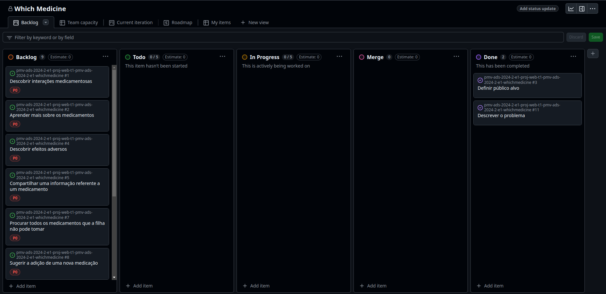

# Metodologia

## Gerenciamento de Projeto

A metodologia `Scrum` foi selecionada pois sua gestão de projetos ágil que tem como objetivo aumentar a produtividade e a qualidade do trabalho desenvolvido. Ela é baseada em três pilares: **transparência**, **inspeção** e **adaptação**.

### Divisão de Papéis

A equipe utiliza o Scrum como base para definição do processo de desenvolvimento.

- **Scrum Master**: Isis Kanitar Castro;
- **Product Owner**: Felipe Miguel Nery Lunkes;
- **Equipe de Desenvolvimento**:
  - Diovane Marcelino Azevedo;
  - Felipe Miguel Nery Lunkes;
  - Fernanda Pinheiro Novais;
  - Isis Kanitar Castro;
  - João Paulo Fernandes Salviano.
- **Equipe de Design (UX)**: Fernanda Pinheiro Novais.
  
### Processo

O fluxo de desenvolvimento do projeto foi definido da forma abaixo:

- Backlog: recebe as tarefas a serem trabalhadas e representa o Product Backlog. Todas as atividades identificadas no decorrer do projeto também devem ser incorporadas a esta lista. 
- To Do: esta lista representa o Sprint Backlog. Este é o Sprint atual que estamos trabalhando. 
- Doing: lista as tarefas em desenvolvimento ativo.
- Done: nesta lista são colocadas as tarefas que passaram pelos testes e controle de qualidade e estão prontos para ser entregues ao usuário. Não há mais edições ou revisões necessárias.

O quadro Kanban relacionado ao projeto está disponível [aqui](https://github.com/orgs/ICEI-PUC-Minas-PMV-ADS/projects/1318). Abaixo, uma exemplo de como ele se parece:

Figura 3 - Quadro Kanban do projeto.

### Etiquetas

As tarefas são, ainda, etiquetadas em função da natureza da atividade e seguem o seguinte esquema de cores/categorias:

<ul>
  <li>Bug (Erro no código)</li>
  <li>Desenvolvimento (Development)</li>
  <li>Documentação (Documentation)</li>
  <li>Gerência de Projetos (Project Management)</li>
  <li>Infraestrutura (Infrastructure)</li>
  <li>Testes (Tests)</li>
</ul>

<figure> 
  
</figure>

Figura 4 - Tela do esquema de cores e categorias.

### Ferramentas

Para o desenvolvimento do projeto, foram selecionadas as seguintes ferramentas/softwares:

* **Editor de código**:
  - Visual Studio Code, com extensões de suporte à JavaScript/TypeScript;
* **Comunicação entre o time**: 
  - Microsoft Teams (comunicação síncrona);
  - Discord (comunicação assíncrona);
  - WhatsApp (comunicação assíncrona);
* **Ferramenta de design de fluxos**:
  - [draw.io](https://draw.io);
  - Figma;
* **Gerenciamento do projeto**:
  * GitHub Projects.

#### Justificativa de escolha das feramentas

* **Editor de código**: gratuito, bastante usado e recomendado por desenvolvedores pela facilidade de uso, suporte à extensões e integração com git, terminal e outras ferramentas que facilitam o desenvolvimento;
* **Comunicação entre o time**: O Microsoft Teams foi escolhido para os encontros síncronos por permitir gravação, registro e controle de comentários e mensagens. Já o Discord e WhatsApp foram selecionados para comunicação asssíncrona por permitirem facilidade de uso;
* **Ferramenta de design de fluxos**: O draw.io é uma ferramenta poderosa de design de fluxos, bastante usada por desenvolvedores. Já o Figma é uma ferramenta padrão para a modelagem de interfaces, sendo fácil e gratuita;
* **Gerenciamento do projeto**: o GitHub Projects se integra ao GitHub, permitindo fácil acompanhamento da execução do projeto.

Os artefatos do projeto são desenvolvidos a partir de diversas plataformas, como GitHub, draw.io e Figma, e a relação dos ambientes com seu respectivo propósito é apresentada na tabela que se segue.

Tabela 6: artefatos gerados pelo projeto.
| AMBIENTE                    | PLATAFORMA      | LINK DE ACESSO                         |
|-----------------------------|-----------------|----------------------------------------|
| Repositório de código fonte | GitHub          | [**Link de acesso**](https://github.com/ICEI-PUC-Minas-PMV-ADS/pmv-ads-2024-2-e1-proj-web-t1-pmv-ads-2024-2-e1-whichmedicine) |
| Documentos do projeto       | GitHub          | [**Link de acesso**](https://github.com/ICEI-PUC-Minas-PMV-ADS/pmv-ads-2024-2-e1-proj-web-t1-pmv-ads-2024-2-e1-whichmedicine/tree/main/documentos) |
| Projeto de Interface        | Figma           | [**Link de acesso**](https://www.figma.com/design/4rNeyfRyfLDr4sYEAqcRBQ/Untitled?node-id=0-1&node-type=canvas&t=HnqXfvU5x9GFBsJE-0) |
| Gerenciamento do Projeto    | GitHub Projects | [**Link de acesso**](https://github.com/orgs/ICEI-PUC-Minas-PMV-ADS/projects/1318) |
| Hospedagem                  | GitHub Pages    | http://....                            |

### Estratégia de Organização de Codificação 

Todos os artefatos relacionados a implementação e visualização dos conteúdos do projeto do site foram e serão inseridos no diretório [codigo-fonte](https://github.com/ICEI-PUC-Minas-PMV-ADS/pmv-ads-2024-2-e1-proj-web-t1-pmv-ads-2024-2-e1-whichmedicine/tree/main/codigo-fonte).

