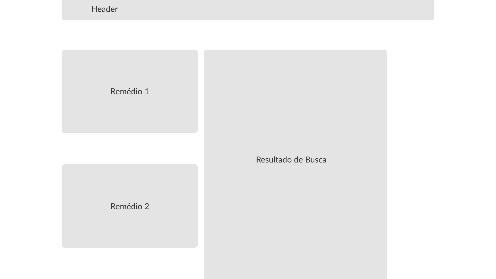
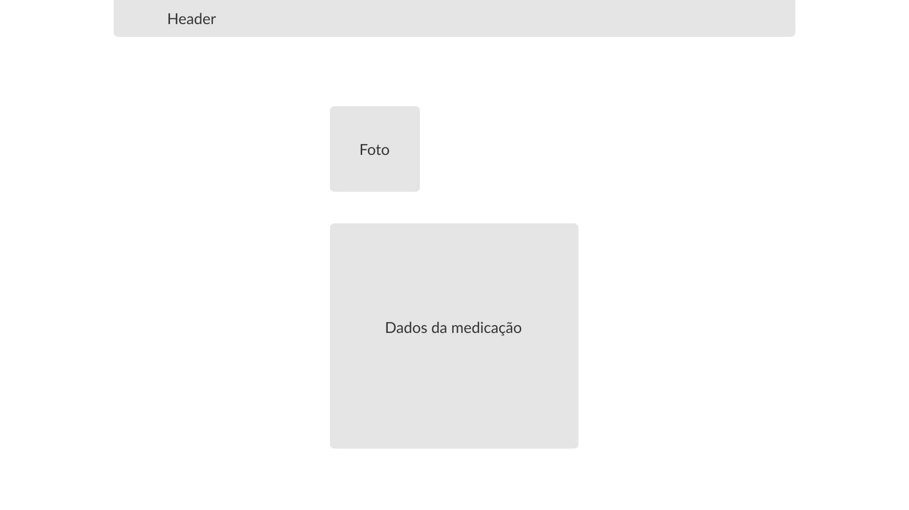

# Projeto de Interface

## User Flow

<!--
Fluxo de usuário (User Flow) é uma técnica que permite ao desenvolvedor mapear todo fluxo de navegação do usuário na aplicação. Essa técnica funciona para alinhar os caminhos e as possíveis ações que o usuário pode fazer junto com os membros de sua equipe.
-->

Abaixo, é possível observar os dois fluxos de usuário construídos para o projeto. Na figura 5 temos o fluxo de usuário para os pacientes (perfil 5), enquanto na figura 6, temos o fluxo de usuário para administradores (perfil 6).

Figura 5: fluxo de usuário para o perfil 1 (paciente).

Figura 6: fluxo de usuário para o perfil 2 (administrador).

## Protótipo

### Protótipo de baixa fidelidade

#### Interface: telas

Abaixo, uma visão geral das telas projetadas para a aplicação. Você pode encontrar o projeto das telas acessando o [Figma](https://www.figma.com/design/4rNeyfRyfLDr4sYEAqcRBQ/Which-Medicine?node-id=0-1&node-type=canvas&t=ktfGMCII6QObEl3h-0).

Figura 7 - Telas da aplicação.

#### **Tela de Início**

Exibe tela inicial da ferramenta composta por menus de busca, possibilidade de login e cadastro, e elementos mais buscados. 

Figura 8 - Tela de início.

#### **Tela Sobre**

Exibe conteúdo referente a justificativa de criação da aplicação. Possui logomarca, cabeçalho e texto sobre as justificas baseadas na literatura para o desenvolvimento da plataforma.

Figura 9 - Tela Sobre.

#### **Tela de informações da plataforma**

Figura 10 - Tela de informações da plataforma.

#### **Tela de cadastro de usuário**

Exibe os dados exigidos do usuário para criar um perfil na aplicação, junto com a possibilidade de inclusão de foto de usuário.

Figura 11 - Tela de cadastro de usuários.

#### **Tela de confirmação de cadastro**

Exibe os dados previamente inseridos para o usuário realizar a confirmação.

Figura 12 - Tela de confirmação de cadastro.

#### **Tela de login**

Exibe os campos para o usuário e o administrador realizarem o login na plataforma.

Figura 13 - Tela de login.

#### **Tela de resultado de busca**

Exibe os dois componentes farmacêuticos comparados, um abaixo do outro, e, lateralmente, o resultado demonstrando se há ou não interação relatada.

Figura 14 - Tela de resultados da busca de interações entre medicamentos.

#### **Tela de sugestão de cadastro de medicamentos**

Exibe ao usuário a possibilidade de sugerir a inserção de um novo composto farmacêutico.

Figura 15 - Tela de sugestão de cadastro de novo medicamento.

#### **Tela de compartilhamento**

Exibe ao usuário a possibilidade de compartilhamento o resultado de sua busca.

Figura 16 - Tela de compartilhamento.

#### **Tela de listagem de medicações cadastradas**

Exibe a lista de medicações cadastradas na plataforma.

Figura 17 - Tela de listagem com as medicações cadastradas na plataforma.

#### **Tela de perfil do usuário**

Exibe o nome do usuário lagado, junto com sua foto, os campos de buscas de interações medicamentosas e as buscas categorizadas como favoritas.

Figura 18 - Tela de perfil do usuário (paciente).

#### **Tela de perfil do administrador**

Exibe o perfil logado como administrador, junto com sua foto, as sugestões realizadas pelos usuários e a lista de medicamentos, com a possibilidade de edição ou exclusão destes.

Figura 19 - Tela de perfil do administrador.

#### **Tela de cadastro e edição de medicamentos**

Exibe, para o administrador, a possibilidade de edição ou novo cadastro de novos medicamentos.

Figura 20 - Tela de cadastro e edição de medicamentos.

#### **Tela de informação de medicação**

Exibe, para o administrador, os dados sobre uma determinada medicação.

Figura 21 - Tela de informações de medicação.

