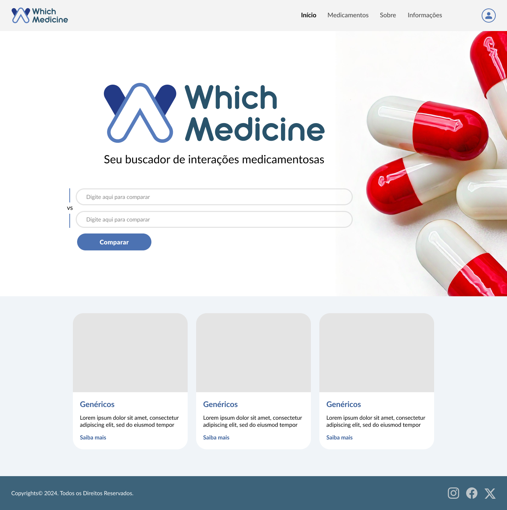

# Template padrão da Aplicação - WhichMedicine

Layout padrão do site (HTML e CSS), utilizado em todas as páginas com a definição de identidade visual, aspectos de responsividade e iconografia.
As páginas apresentam como elementos padrão o menu de navegação, cabeçalho, rodapé e os elementos visuais citados abaixo:

### Identidade visual (elementos visuais)

#### Cores:
  
  * **Primárias**: RGB #203960, #2A4B7E, #385E99, #4C72B2, #577CBD, #7E9BD8, #99B0E6, #B6C6F0, #D3DCF7, #F1F3FD;
  * **Secundárias**: RGB #233C4C, #2E4F63, #3D637A, #4F7790, #648BA5, #7DA0B8, #97B4CA, #B3C9DA, #D1DFE9, #F0F4F8;
  * **Escala de Cinza**: RGB #4B4B4B, #5E5E5E, #727272, #868686, #868686, #B0B0B0, #C6C6C6, #DDDDDD, #F3F3F3.

#### Família de fontes (font-family):
  
  **Lato**, disponível [aqui]();

#### Tamanho das fontes (font-size):

##### HeadLine
  * **H1**: Lato ExtraBold - 64px;
  * **H2**: Lato ExtraBold - 56px;
  * **H3**: Lato Bold - 32px;
  * **H4**: Lato Regular - 32px;
  * **H5**: Lato Bold - 22px;
  * **H6**: Lato Bold - 18px.

##### Subtitle:

 **Lato Medium** - 18px.

##### Body

  * Body Small: Lato Regular - 14px com line-height de 16px;
  * Body: Lato Regular - 16px com line-height de 20px;
  * Body Large: Lato Regular - 18px com line-height de 24px.

##### Caption

Lato Regular: 12px. 

##### Nagation

  * **N1**: Lato Medium: 18px;
  * **N2**: Lato Bold: 18px.

## Interface da aplicação

### Tela de Início

Exibe tela inicial da ferramenta composta por menus de busca, possibilidade de Login e Cadastro, e elementos mais buscados.

<figcaption>Figura 22 - Tela de Início</figcaption>

### Tela Cadastro

Exibe os dados exigidos do usuário para criar um perfil na aplicacao, junto com a possibilidade de inclusao de foto do mesmo.

<figcaption>Figura 23 - Tela de Cadastro</figcaption>

## iconografia

A criação do logotipo do site tomou como referência a letra "W" em formatos alusivos à comprimidos, na cor #577CBD, #233A86 e #29536B

 <figcaption>Figura 24 - Logo Which Medicine</figcaption>

