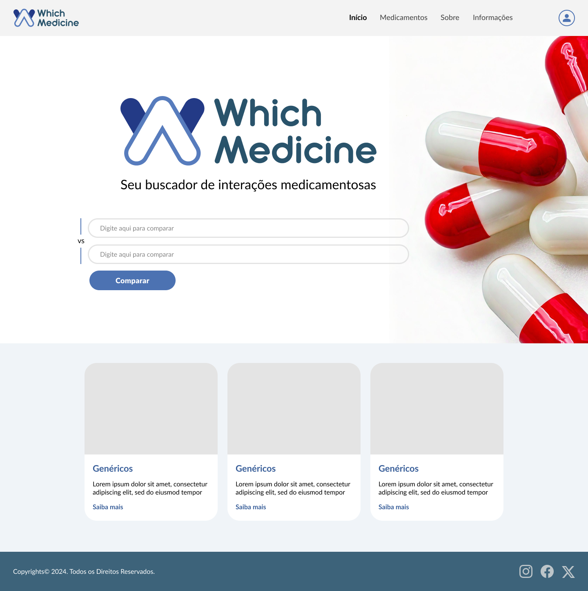
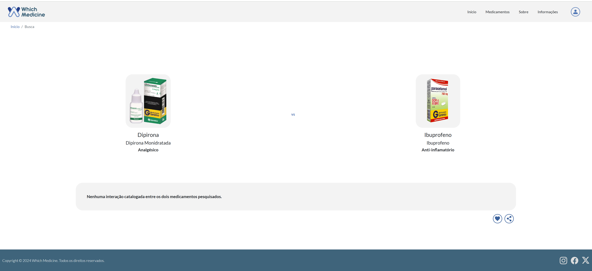
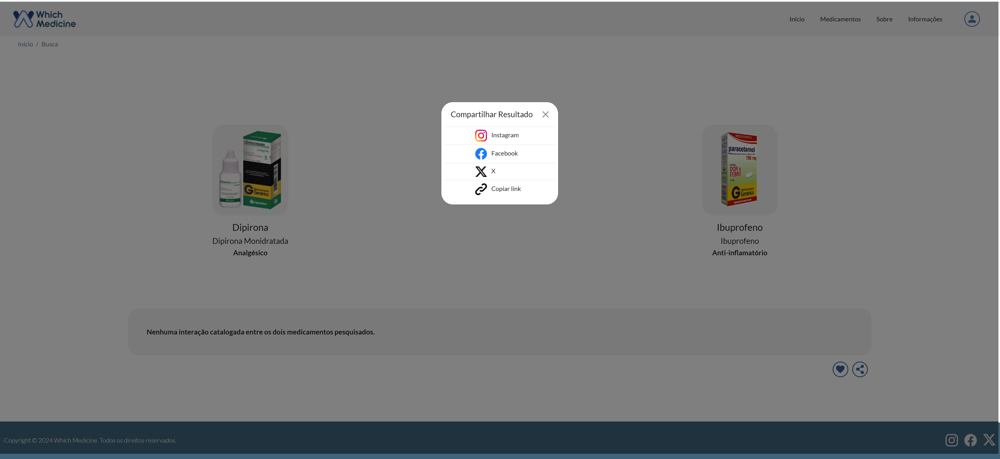
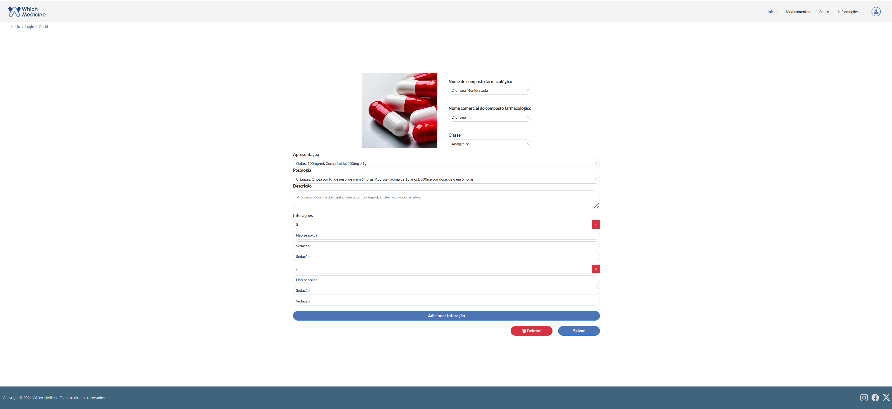
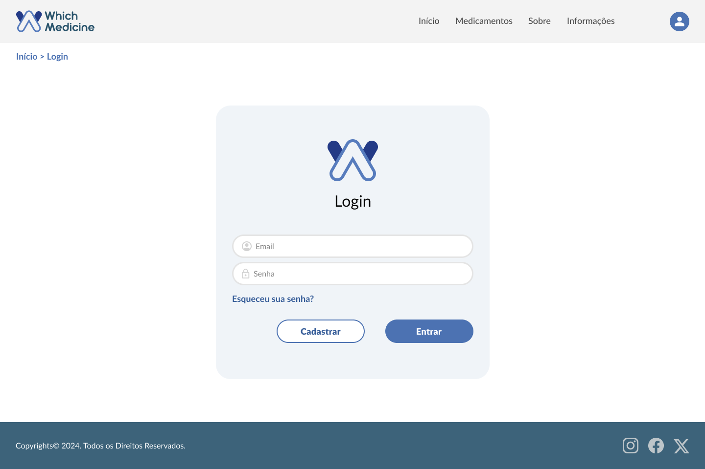
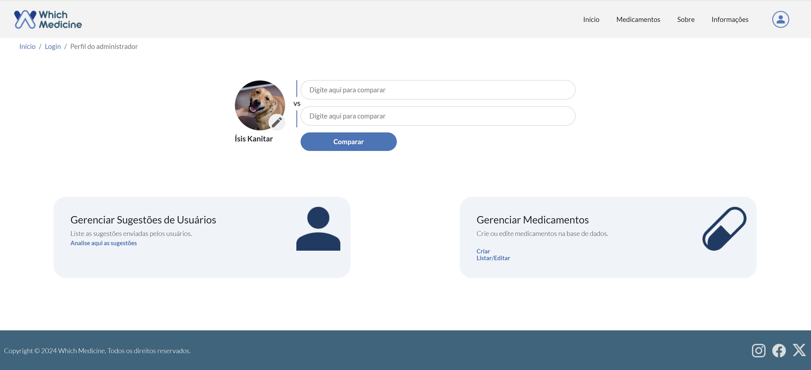
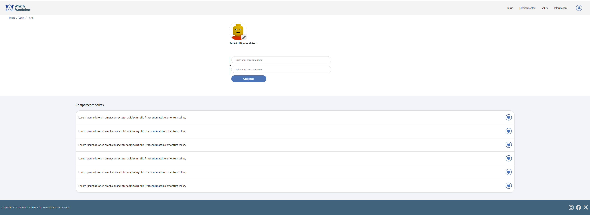
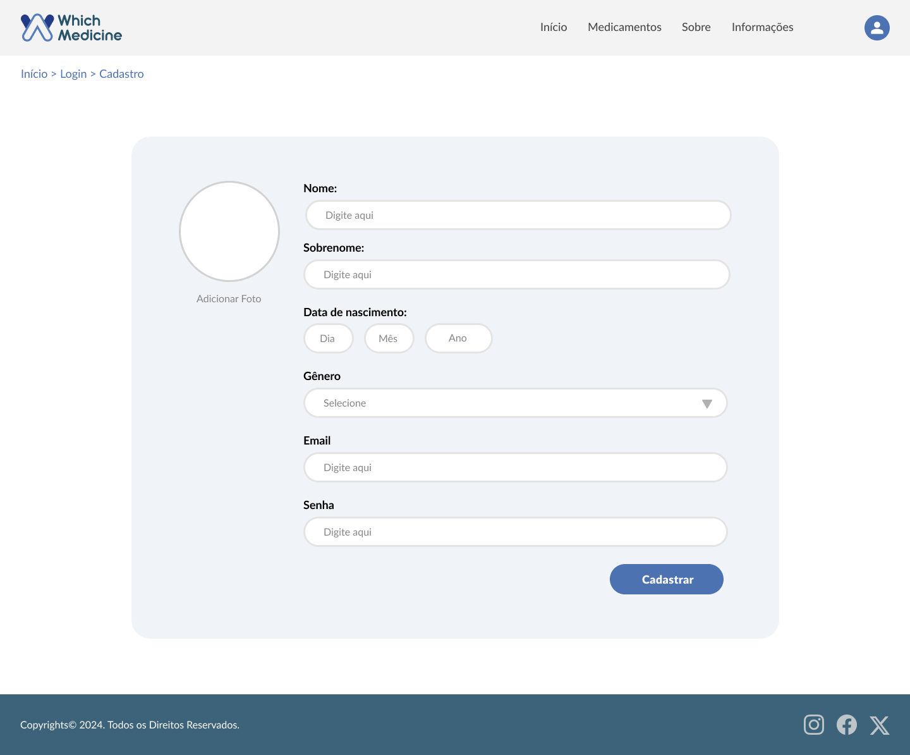

# Programação de Funcionalidades

Implementação da aplicação descritas por meio dos requisitos codificados. 

### Tela de busca (RF-01/ RF-02)

Responsável: João/ Felipe/ Ísis/ Diovane/ Fernanda.

A aplicação deve permitir a busca dos compostos medicamentosos ou o seu nome comercial.

 
<figcaption>Figura 25 - Tela de Busca.</figcaption>

#### Requisito atendido

RF-01/ RF-02: A aplicação permite a busca de compostos medicamentosos pelo seu nome comercial ou farmacológico.

#### Artefatos da funcionalidade

* index.html;
* index.js;
* styless.css.

#### Instruções de acesso

Abra um navegador de Internet e informe a seguinte URL: https://icei-puc-minas-pmv-ads.github.io/pmv-ads-2024-2-e1-proj-web-t1-pmv-ads-2024-2-e1-whichmedicine/codigo-fonte e selecione as que deseja buscar. Após. clique no botão "Comparar" para obter o resultado.

### Tela de Resultado de Busca (RF-03/ RF-04)

Responsável: João.

A aplicação deve exibir a aplicação de cada uma das medicações informadas pelo usuário.

<figcaption> Figura 26 - Tela Resultado de Busca. </figcaption>

#### Requisito atendido

RF-03/ RF-04: A aplicação exibe os resultados de busca da comparação de dois medicamentos.

#### Artefatos da funcionalidade

* result.html;
* result.js;
* styles.css.

#### Instruções de acesso

Abra um navegador de Internet e informe a seguinte URL:https://icei-puc-minas-pmv-ads.github.io/pmv-ads-2024-2-e1-proj-web-t1-pmv-ads-2024-2-e1-whichmedicine/codigo-fonte/pages/result/result.html sendo exibido o resultado de busca de comparação entre dois medicamentos e se existem interaçãoes ou não.

### Tela de Compartilhamento (RF-05)

Responsável: João.

A aplicação deve compartilhar informações sobre uma medicação via redes sociais e e-mail.

<figcaption>Figura 27 - Tela de Compartilhamento.</figcaption>

#### Requisito atendido

RF-05: A aplicação permite o compartilhamento do resultado de busca.

#### Artefatos da funcionalidade

* result.html;
* result.js;
* styles.css.

#### Instruções de acesso

Abra um navegador de Internet e informe a seguinte URL:https://icei-puc-minas-pmv-ads.github.io/pmv-ads-2024-2-e1-proj-web-t1-pmv-ads-2024-2-e1-whichmedicine/codigo-fonte/pages/result/result.html, no canto inferior direito clique no botão com o símbolo de compartilhamento para abrir a janela modal de compartilhamento.

### Tela Edição no Perfil do Administrador (RF-06/RF-09)

Responsável: João.

A aplicação deve permitir a alteração e adição de dados para o perfil administrador.

<figcaption>Figura 28 - Tela Edição de Medicação Perfil Administrador</figcaption>

#### Requisito atendido

RF-06/RF-09: A aplicação permite a edição dos dados pelo perfil administrador.

#### Artefatos de Funcionalidade

* adm-med-manage.html;
* adm-med-manage.js;
* adm-med-manage.css.

#### Instruções de acesso

Abra um navegador de Internet e informe a seguinte URL:https://icei-puc-minas-pmv-ads.github.io/pmv-ads-2024-2-e1-proj-web-t1-pmv-ads-2024-2-e1-whichmedicine/codigo-fonte/pages/adm-med-manage/adm-med-manage.html?edicao=1 todos os campos nesta página são editáveis e, somente são acessíveis ao perfil administrador. 

### Tela de Login (RF-07)

Responsável: Felipe (Tela Login);
Responsável: Felipe (Tela de atualização de perfil);
Responsável: Fernanda (Tela Perfil Administrador);
Responsável: Diovane (Tela Perfil Usuário).

A aplicação deve permitir o login de administrador e login de usuário.

<figcaption>Figura 29 - Tela de Login</figcaption>

<figcaption>Figura 30 - Tela Perfil Administrador</figcaption>

<figcaption>Figura 31 - Tela Perfil Usuário</figcaption>

#### Requisito atendido

RF-07: A aplicação permite realizar login sendo perfil administrador ou perfil usário.

#### Artefatos da funcionalidade

* Tela Login:
  * login.html;
  * login.js;
  * start.js;
  * styles.css;

* Tela Perfil Administrador:
  * adm.html;
  * adm.j;
  * styles.css;

* Tela Perfil Usuário:
  * profile.html;
  * profile.js;
  * styles.css.

#### Instruções de Acesso

Abra um navegador de Internet e informe a seguinte URL: https://icei-puc-minas-pmv-ads.github.io/pmv-ads-2024-2-e1-proj-web-t1-pmv-ads-2024-2-e1-whichmedicine/codigo-fonte/pages/login/login.html para acessar a página de Login. Após inserir os dados, caso seja perfil administrador seguirá para esta página URL: (completar). Caso seja perfil usário seguirá para esta página URL: (completar).

### Tela de Cadastro (RF-08)

Responsável: Ísis.

A aplicação deve permitir a criação de usuário inserindo data de nascimento e gênero.

<figcaption>Figura 32 - Tela de Cadastro</figcaption>

#### Requisito atendido

RF-08: A aplicação permite criar cadastros de usuários inserindo data de nascimento e gênero.

#### Artefatos da funcionalidade

* register.html;
* register.js;
* styles.css.

#### Instruções de Acesso

Abra um navegador de Internet e informe a seguinte URL:https://icei-puc-minas-pmv-ads.github.io/pmv-ads-2024-2-e1-proj-web-t1-pmv-ads-2024-2-e1-whichmedicine/codigo-fonte/pages/register/register.html e após digitar todos os dados e clicar em cadastrar, estes estarão inseridos da base de dados como usuário.

### Estrutura de Dados

Responsável: Ísis e Felipe.

Foram confeccionadas 4 estruturas de dados. A primeira para gerenciar os perfis usuário e administrador, e a segunda para gerenciamento da lista de medicamentos e suas devidas interações. Já a terceira tabela está relacionada com as sugestões de usuários, e a quarta, às notícias da aplicação.

#### Artefatos de Funcionalidade

* boot.js.

